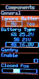
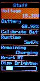

# MiniMenu

MiniMenu is a library designed for easy creation of a graphical, joystick / button controlled menu.

The following images are from the private project, where this library was taken out:

 

The library is free to use as the licence defines, but i would still be glad if it could be mentioned if your project has a place for it.

## Basics

### Requirements

- Any device of the arduino environment. The library was built using a ESP32, so everything is tested with this chip.
- Usage of a display based on the [Adafruit GFX](https://github.com/adafruit/Adafruit-GFX-Library) library
- A button, joystick or similar based input supporting the following five inputs: up, down, left, right & push/enter

### Features

- Multiple tabs: Add multiple tabs, which can be selected by the `left/right` input
- Multiple entries per tab: Add as many read or read&write entries per tab as you want. "Scroll" through them using the `up/down` input.
- Entry-type based input handling: The currently selected entry decides what happens when `enter` is pressed.
    - A boolean-checkbox will just check/uncheck
    - A int / float slider will go into "input-mode". `left/right` will now move the slider and edit the value instead of scrolling through tabs/entries until `enter` is pressed again
    - A simple text-entry won't react at all.
- Entries can be made non-selectable entirely.
- Most entry-types support multiple possibilities of reading/writing to local variables, such as reference-based direct read/write, or through read/write callback-functions

### Utility

- The `Adafruit_GFX` library will write to the display directly, which can be quite slow.
- MiniMenu uses many draw-commands, so to speed this up, there is a utility class `Framebuffer`.
- It will create a "virtual display" in memory, which can be written to as usual. When all the small draw-calls are done, just draw the resulting image to the actual display.

## Usage

- Note: I am using the default Arduino-Plattform, so the following instructions are made for this plattform. The library could still work with other environments like platform.io.

- First, checkout the library into `your_arduino_project/src/MiniMenu`
- Setup your Adafruit-GFX device as usual
- Create an instance of the MiniMenu anywhere you can access it, giving it the instance of the `Adafruit_GFX` (usualy the display instance):
```
MiniMenu::Menu* menu = new MiniMenu::Menu(gfx);
```
- set up the general parameters of the menu, like draw-area and colors:
```
menu->drawArea = MiniMenu::Rect(0, 0, 80, 160);
menu->parameters.selectedBackgroundColor = gfx.color565(250,156,30);
menu->parameters.frameColor = gfx.color565(250,156,30);
```
- build the structure of the menu. Please note, that everything will be stored by the menu itself, so you only need the references to the created tabs/entries localy the set them up. Start with adding a tab:

```
auto& mytab = menu->AddTab();
```

- if you want your tab to have a header which should always be visiable, add a simple text-entry and set the fixed entry-count of your header to one:

```
mytab.SetFixedEntryCount(1);
mytab.AddEntry(new MiniMenu::MenuEntry(*menu)).SetTitle("My Tab").SetTitlePosition(MiniMenu::MenuEntry::HorizontalPosition::Center).SetIsSelectable(false);
```

- add move entries and tabs as you want (see below). When done, just update the menu's inputs and handle the menu (both in the main-loop) to draw it:

```
menu->input.up.UpdateContinuos(digitalRead(myUpInput) == 0);
menu->input.down.UpdateContinuos(digitalRead(myDownInput) == 0);
menu->input.left.UpdateContinuos(digitalRead(myLeftInput) == 0);
menu->input.right.UpdateContinuos(digitalRead(myRightInput) == 0);
menu->input.enter.UpdateContinuos(digitalRead(myEnterInput) == 0);
menu->Handle(true);
```

### Examples for entries:
- Tab for voltage:

```
mytab.AddEntry(new MiniMenu::GenericValueMenuEntry(*menu, myVoltageVariable)).SetTitle("Voltage").SetDefaultFormatter().SetPostfix("V");
```

- Tab for battery percentage:

```
mytab.AddEntry(new MiniMenu::GenericValueMenuEntry(*menu, myPowerPercentage)).SetTitle("Battery").SetFormatter(new MiniMenu::GenericValueMenuEntry::PercentFormatter());
```

- Tab for device runtime:

```
auto& runtimeEntry = mytab.AddEntry(new MiniMenu::GenericValueMenuEntry(*menu)).SetTitle("Runtime");
runtimeEntry.SetFormatter(new MiniMenu::GenericValueMenuEntry::TimeFromMillisecondsFormatter());
runtimeEntry.SetGetter(new MiniMenu::GenericValueMenuEntry::FunctionValueGetter<MiniMenu::GenericValueMenuEntry::ValueType::uint32, unsigned long>(&millis));
```

- Simple callback-on-enter function:

```
mytab.AddEntry(new MiniMenu::PushCallbackMenuEntry(*menu, [this](){ doSomething(); })).SetTitle("Do it!");
```

- Int-based slider:

```
mytab.AddEntry(new MiniMenu::IntSliderMenuEntry<uint16_t>(*menu, myUint16Variable)).SetMinMax(600, 2400).SetChangeRate(800).SetTitle("My uint16");
```

- Float-based slider:

```
mytab.AddEntry(new MiniMenu::FloatSliderMenuEntry(*menu, myFloatVariable)).SetMinMax(0.1f, 3.f).SetChangeRate(0.5f).SetTitle("Move Speed");
```

- Enum based selection:

```
auto& voltageModeEntry = mytab.AddEntry(new MiniMenu::EnumSelectorMenuEntry<Power::VoltageMode>(*menu, myvoltageMode));
voltageModeEntry.SetTitle("Battery Type");
voltageModeEntry.AddEntry(Power::VoltageMode::LiIon_6S_25d2V, "6S 25.2V");
voltageModeEntry.AddEntry(Power::VoltageMode::LiIon_5S_21V, "5S 21V");
voltageModeEntry.AddEntry(Power::VoltageMode::LiIon_4S_16d8V, "4S 16.8V");
```
